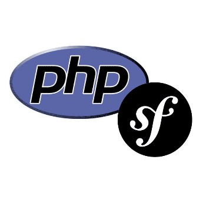

Course MVC
=====================
Here is hopefully a very simple guide as to how to clone the and run the app on your local machine.

1. Make sure that you run PHP 8.2 and composer version 2.5.8 on you local machine.

2. Clone the repo by running this command in the terminal ```git clone https://github.com/Iwinter78/mvc.git```.

3. Stand in the root folder of the project and run ```php -S localhost:8888 -t public```.

4. Access the website by typing ```localhost:8888``` in you web browser.

5. Profit!